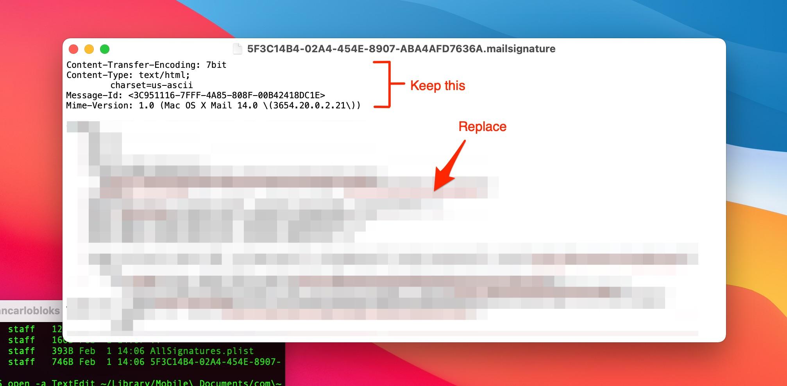

# Email Signature

To install this signature in the Mail App using iCloud Drive on OS X Big Sur:

Open terminal and paste:
`ls -laht ~/Library/Mobile\ Documents/com~apple~mail/Data/V4/Signatures/`

Then paste:
`open -a TextEdit ~/Library/Mobile\ Documents/com\~apple\~mail/Data/V4/Signatures/*.mailsignature`

This opens a TextEdit file. Here you simply remove everything below the metadata:

Save & Close. Open the Mail App and you should see your new signature.